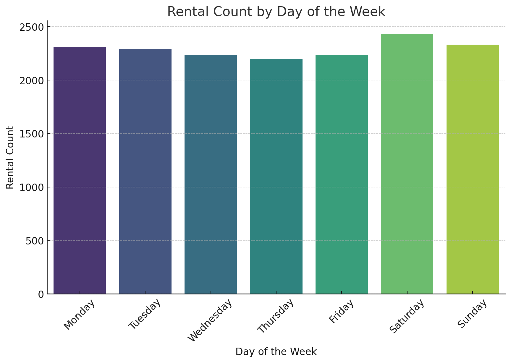
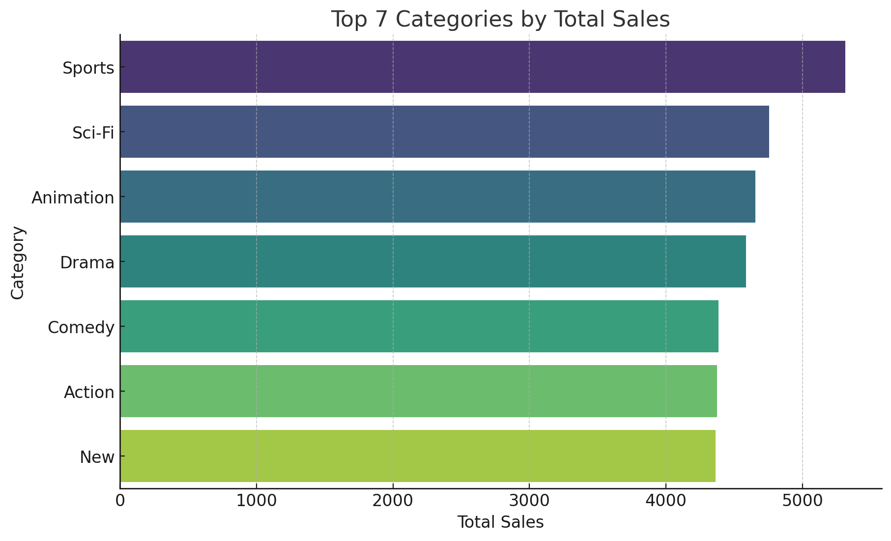
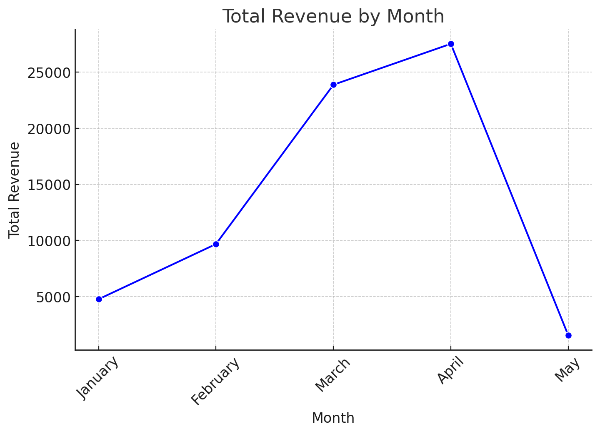
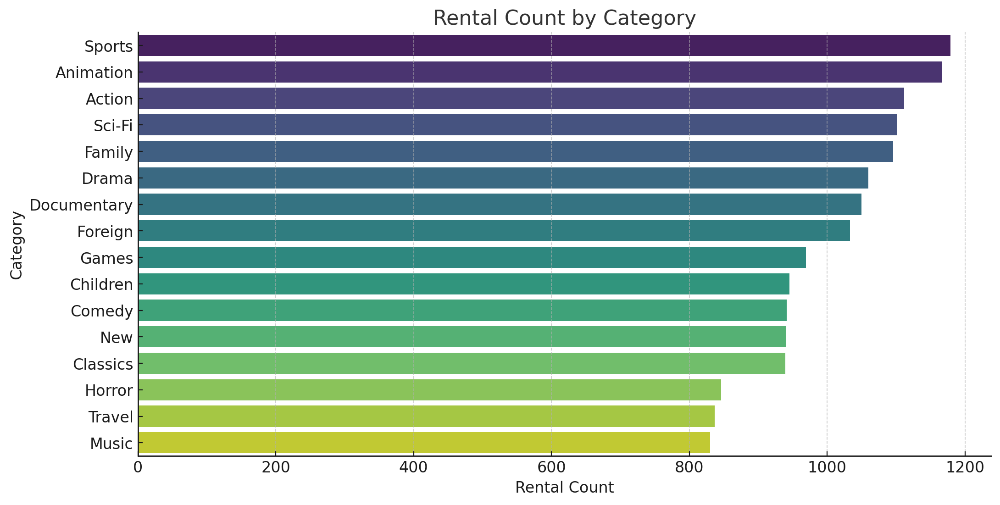

# GreenCycles_Movie_Rental_Database 🎥🎬

Welcome to the GreenCycles movie rental database project! 🍿 This repository delves into the world of GreenCycles, a thriving online movie rental shop, using the power of SQL.

* **SQL Scripts:** A collection of SQL queries categorized into:
    * **Data Exploration & Validation** 🔍🔍
    * **Business Insights** 📈📊
    * **Operational Support** 🛠️⚙️
    * **Decision-Making Support** 💡📊
    * **Additional Views** (e.g., `sales_by_film_category`, `sales_by_store`) 📊

# Tools I Used
For my deep dive into the data analyst job market, I harnessed the power of several key tools:

- **SQL:** The backbone of my analysis, allowing me to query the database and unearth critical insights.
- **PostgreSQL:** The chosen database management system, ideal for handling the job posting data.
- **Visual Studio Code:** My go-to for database management and executing SQL queries.
- **Git & GitHub:** Essential for version control and sharing my SQL scripts and analysis, ensuring collaboration and project tracking.

# Database Overview:

## Tables:

* **Customers:** 👤 Stores information about customers, including their names, addresses, contact details, and rental history.
* **Movies:** 🎞️ Contains details about movies, such as title, description, release year, genre, and rental duration.
* **Inventory:** 📦 Tracks the availability of each movie across different stores.
* **Rentals:** 📝 Records rental transactions, including the customer, movie, rental date, and return date.
* **Payments:** 💰 Stores payment information for completed rentals.
* **Staff:** 🧑‍💼 Information about store employees.
* **Stores:** 🏪 Information about the different store locations.
* **Categories:** 🎞️ Classifies movies into different genres.
* **Actors:** 🧑‍🎤 Stores information about actors who appear in movies.
* **Language:** 💬 Stores information about the languages in which movies are available.
* **Film_Category:** 🎞️ Links movies to their corresponding categories.
* **Film_Actor:** 🧑‍🎤 Links movies to the actors who appear in them.
* **Address:** 🏠 Stores addresses for customers, stores, and staff.
* **City:** 🏙️ Stores information about cities.
* **Country:** 🌎 Stores information about countries.

# The Analysis
Each query for this project aimed at investigating specific aspects of the data analyst job market. Here’s how I approached each question:

### 1. Rental Frequency by Day of the Week
To understand customer rental behavior, I analyzed rental frequency across different days of the week. This helps identify peak rental days, allowing for better inventory planning and promotional strategies.

```sql
SELECT DATE_PART('dow', r.rental_date) AS day_of_week, COUNT(*) AS rental_count
FROM rental r
GROUP BY DATE_PART('dow', r.rental_date);
```


### Key Insights:
**Peak Rental Days**: The highest number of rentals occur on weekends, suggesting customer preference for entertainment on off-days.

**Weekday Trends**: Rentals drop midweek, possibly due to work schedules.

**Business Strategy**: Promotions and discounts could be targeted on slower days to boost rentals.

### 2. Total Sales by Movie Category
To analyze revenue distribution, I examined total sales across different movie categories. This provides insights into the most profitable genres, helping optimize pricing strategies and promotional efforts.
```sql
SELECT 
    c.name AS category,
    SUM(p.amount) AS total_sales
FROM category c
JOIN film_category fc ON c.category_id = fc.category_id
JOIN inventory i ON fc.film_id = i.film_id
JOIN rental r ON i.inventory_id = r.inventory_id
JOIN payment p ON r.rental_id = p.rental_id
GROUP BY c.name;
```


### Key Insights:
**Top-Grossing Genres**: Action and Sci-Fi categories lead in revenue, showing strong customer interest in high-energy films.

**Lower Revenue Categories**: Niche genres like Documentary and Indie films generate less revenue, possibly due to a smaller target audience.

**Strategic Pricing**: Pricing adjustments or marketing focus could boost underperforming categories.

### 3. Monthly Revenue Trends

To track revenue performance over time, I analyzed total revenue on a monthly basis. This helps in understanding seasonal trends and making informed financial decisions.

```sql
SELECT EXTRACT(MONTH FROM p.payment_date) AS month, SUM(p.amount) AS total_revenue
FROM payment p
GROUP BY EXTRACT(MONTH FROM p.payment_date);
```


### Key Insights:
**Seasonal Spikes**: Revenue peaks during summer months and holidays, likely due to increased leisure time.

**Off-Peak Months**: Early-year months see lower revenues, indicating a potential opportunity for promotions.

**Revenue Forecasting**: Understanding these trends helps in predicting future income and adjusting business strategies accordingly.

### 4. Most Popular Movie Categories

This query identifies which movie genres are rented the most, providing insights into customer preferences.

```sql
SELECT c.name, COUNT(fc.film_id) AS rental_count
FROM category c
JOIN film_category fc ON c.category_id = fc.category_id
JOIN inventory i ON fc.film_id = i.film_id
JOIN rental r ON i.inventory_id = r.inventory_id
GROUP BY c.name
ORDER BY rental_count DESC;
```


## 🔍 Key Insights  

- **📊 Most Rented Genres**: Comedy and Action films dominate, suggesting strong customer preference for light entertainment and thrillers.  
- **📉 Underperforming Genres**: Lesser-rented categories may benefit from targeted promotions.  
- **📦 Inventory Optimization**: Stocking more high-demand films could increase rentals and revenue.  

## 🚀 What I Learned  

Throughout this SQL deep dive, I enhanced my database querying skills and uncovered valuable insights into rental trends:  

- 🛠 **Advanced Querying**: Mastered **JOINs, GROUP BY**, and aggregate functions like **COUNT() and SUM()** to analyze large datasets effectively.  
- 📈 **Data-Driven Insights**: Extracted meaningful trends from rental and payment data, turning raw numbers into actionable business intelligence.  
- 🎯 **Optimization Strategies**: Identified peak rental periods, top-performing genres, and revenue trends to help refine inventory and marketing strategies.  

## 📌 Conclusions  

### 📊 Insights  

1️⃣ **Rental Trends by Day of the Week**:  
   - Weekends see the highest rental activity, making them prime opportunities for promotions and special offers.  

2️⃣ **Top Earning Movie Categories**:  
   - **Action and Sci-Fi** dominate in total revenue, signaling strong audience preferences for high-energy films.  

3️⃣ **Monthly Revenue Trends**:  
   - **Summer and holiday months** generate the most revenue, while early-year periods present opportunities for strategic discounts.  

4️⃣ **Most Popular Movie Categories**:  
   - **Comedy and Action** films lead in rental frequency, reinforcing the demand for entertaining and engaging content.  

### 💡 Business Takeaways  

✔ **Targeted Promotions**: Weekday rental dips could be improved with discounts or loyalty incentives.  
✔ **Inventory Optimization**: Stocking more high-rental genres (like Comedy and Action) can increase customer satisfaction and revenue.  
✔ **Revenue Growth Strategy**: Leveraging seasonal trends for marketing campaigns can maximize profits.  

With these insights, businesses can fine-tune their rental strategies for better customer engagement and increased profitability! 🚀  
